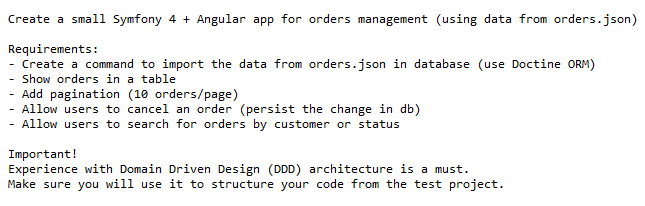

# Order Management

This project was developed to test and showcase my skills as part of a technical assessment I found while searching for job opportunities. I was particularly drawn to the requirements stated in the job posting.


## Requirements

The technical test that inspired this project had the following requirements:



## Approach

I have chosen to structure the code following the Domain-Driven Design (DDD) principles and the Action Domain Responder (ADR) pattern. These methodologies have been instrumental in ensuring the code is scalable, maintainable, and aligns with industry best practices.


## Features

- Import / List / Filter / Cancel Orders
- Localization i18n

## Technologies

Order Management uses a number of open source projects to work properly:

- [Docker] - Containerization platform to install and deploy without host dependency.
- [Symfony] - PHP framework for fast developing.
- [PostgreSQL] - Object-relational database to store orders.json content.
- [Angular] - Javascript framework for building the SPA.
- [Angular Material] - Material Design components for Angular.

## Installation

Order Management requires [Docker] v20+ and [Docker Compose] v2+ to run.

Install the requirements, clone repository and deploy.

### Backend
```sh
git clone git@github.com:gabrieldosanjosbr/order-management.git order-management && cd order-management
#make sure you have permission to edit the hosts file
echo "127.0.0.1 order.management api.order.management" >> /etc/hosts
docker-compose up -d
docker-compose exec php composer install
docker-compose exec php bin/console doctrine:migrations:migrate
```

- Import resources/orders.json with following command

```sh
docker-compose exec php bin/console app:order:import
```

### Frontend
```sh
docker-compose exec node npm install
docker-compose exec node npm install -g @angular/cli
docker-compose exec node ng serve --host 0.0.0.0 --configuration=development #to change locale use --configuration=ptBR
```

## Usage
- Open your favorite browser and go to

```sh
http://order.management
```


## License

MIT

**Free Software, Hell Yeah!**

[Docker]: <https://www.docker.com/>
[Symfony]: <https://symfony.com/>
[Angular]: <https://angular.io/>
[Angular Material]: <https://material.angular.io/>
[PostgreSQL]: <https://www.postgresql.org/>
[Docker Compose]: <https://docs.docker.com/compose/>

